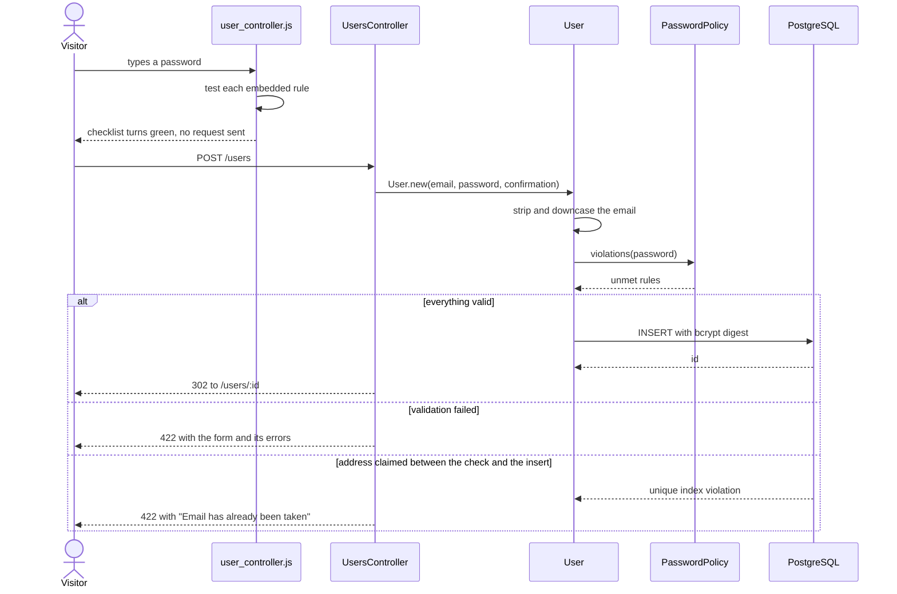

# Bark signup challenge

One screen, one form. You give it an email address and a password, it checks the
password against a published policy in the browser *and* again in the model, and
it writes a `User` row holding a bcrypt digest. That is the entire application:
no session, no login, no account management. It is a take-home exercise and it
deliberately does one thing.

The repo name will not help you: "Bark" appears nowhere in the code except the
page title and the default database name, and there is no bark, dog or pet
domain in here. It is a Rails 7.1 signup form on PostgreSQL.

## The form

| Live checklist as you type | A rejected submission comes back with its errors |
| --- | --- |
|  |  |

| Confirmation after a successful signup | Unknown `/users/:id` |
| --- | --- |
|  |  |

Captured with Playwright at 1440x900 against the app running locally; the
"email has already been taken" error in the second shot is against a seeded
account (`bin/rails db:seed`).

## One place where the password rules live

The only structurally interesting thing here is that a signup form has *two*
places that must agree about what a strong password is, and this one has a
single definition feeding both.

[`app/models/password_policy.rb`](app/models/password_policy.rb) holds the rules
as data — a list of `{key, pattern}` structs plus `MIN_LENGTH` (8) and
`MAX_LENGTH` (72, because bcrypt silently truncates anything past 72 bytes and
accepting a password whose tail is ignored is worse than rejecting it).

From there the same list reaches both enforcement points:

- **Server.** `PasswordFormatValidator` is an `ActiveModel::EachValidator`, so
  `User` just declares `validates :password, password_format: true`. Length
  stays on Rails' built-in `length` validator, which keeps the standard
  `:too_short` / `:too_long` error types working for the shoulda matchers.
- **Browser.** `PasswordPolicy.as_json` is rendered into the form as a Stimulus
  value (`data-user-policy-value`), and `user_controller.js` does
  `new RegExp(rule.pattern)` on the exact `Regexp#source` the server validated
  with. The client is guidance, not a gate — every rule is checked again
  server-side.

That second path only holds while the patterns stay portable, so
`spec/models/password_policy_spec.rb` asserts that no rule uses lookbehind, a
POSIX bracket class, a Ruby-only anchor or a regexp option, none of which
survive the `.source` round trip into JavaScript.

Adding a rule is one entry in `RULES` and two lines in `config/locales/en.yml`.
Whitespace deliberately does not count as a special character (`[^A-Za-z0-9\s]`),
and a spec pins that.

## A signup, end to end



The last branch is the one worth noticing: `validates :uniqueness` issues a
`SELECT` that two concurrent signups can both pass, so the unique index on
`email` is what actually decides. `create` rescues `ActiveRecord::RecordNotUnique`
and renders it as an ordinary form error rather than letting it surface as a 500.
Email is normalised on assignment rather than compared with
`case_sensitive: false`, which would emit `LOWER(email) = LOWER($1)` and could
not use that index.

## Running it

Needs Ruby 3.2.8 and a PostgreSQL server.

```bash
bin/setup          # bundle install, copy .env.example, prepare the database
bin/rails db:seed  # optional: four sample accounts
bin/rails server   # http://localhost:3000
```

With Docker instead — the image is authored but has not been built in this
environment, so treat this as untested:

```bash
cp .env.example .env
echo "SECRET_KEY_BASE=$(bin/rails secret)" >> .env
docker compose up --build   # http://localhost:8570
```

## Environment variables

Everything is read from the environment and `config/database.yml` carries no
literal credentials. `DATABASE_URL`, if set, overrides the individual database
variables. Note that the Rails process itself does not load `.env` (there is no
`dotenv` gem); `bin/setup` writes it for you, and `docker compose` is what reads
it.

| Variable | Required | Default | Purpose |
| --- | --- | --- | --- |
| `DATABASE_HOST` | no | `localhost` | PostgreSQL host |
| `DATABASE_PORT` | no | `5432` | PostgreSQL port |
| `DATABASE_USER` | no | unset (local socket user) | PostgreSQL role |
| `DATABASE_PASSWORD` | no | unset | Password for that role |
| `DATABASE_NAME` | no | `bark_test_challenge_development` | Database in development and production |
| `TEST_DATABASE_NAME` | no | `bark_test_challenge_test` | Database used by the suite |
| `DATABASE_URL` | no | unset | Full connection URL, overriding the five above |
| `RAILS_MAX_THREADS` | no | `5` | Puma threads *and* the Active Record pool size, so the pool can never be smaller than the threads competing for it |
| `RAILS_LOG_LEVEL` | no | `info` | Production log level |
| `FORCE_SSL` | no | `true` | Set to `false` when TLS is terminated upstream or when running over plain HTTP |
| `SECRET_KEY_BASE` | in production | none | Cookie and signed-message key, from `bin/rails secret` |
| `REDIS_URL` | no | `redis://localhost:6379/1` | Action Cable adapter in production only |

## The suite

```
$ bundle exec rspec
54 examples, 0 failures

$ bundle exec rubocop
34 files inspected, no offenses detected
```

A PostgreSQL server has to be reachable — point the suite at one with
`DATABASE_HOST` / `DATABASE_PORT` or `DATABASE_URL`. bcrypt runs at its minimum
cost factor in the test environment, so the full run takes about a second and a
half.

The four spec files are layered on purpose:

- `spec/models/password_policy_spec.rb` — the rules themselves, plus the
  JavaScript-portability guard described above.
- `spec/models/user_spec.rb` — validations, email normalisation, and that the
  unique index is a real backstop rather than a comment.
- `spec/requests/users_spec.rb` — real templates rendered. This is the layer
  that pins the status codes: 422 on a rejected form so Turbo replaces the page,
  400 when the `user` params key is missing, 422 on a lost uniqueness race, and
  404 for an unknown id.
- `spec/controllers/users_controller_spec.rb` — assignment and template choice.

Controller specs do not render views, which is exactly how a re-rendered form
that raises can hide behind a green suite; that is why the request specs exist.

## Choices worth a reviewer's time

**Only the railties this app uses.** `config/application.rb` requires Active
Record, Action Controller, Action View, Active Job and Action Cable by name
instead of `rails/all`. Active Storage, Action Mailbox, Action Text and Action
Mailer are not referenced anywhere, so they are not loaded — one less pile of
configuration to keep correct. Action Cable stays because Turbo depends on it,
and its development adapter is `async`, so no Redis server is needed to run the
app locally.

**Errors are handled where the template is.** `ExceptionHandler` carries only the
genuinely app-wide case (`RecordNotFound` → a 404 page). `ParameterMissing`
recovery lives in `UsersController`, because re-rendering `users/new` is that
controller's business and a shared concern should not need to know which views
exist where.

**Nothing is fetched from a third party.** No CDN script, style, font or image;
Bootstrap is compiled from the gem and the background is a CSS gradient, so the
page renders identically offline. That lets the content security policy be
`self` throughout, with a per-request nonce for importmap's inline
`<script type="importmap">` and Turbo's injected progress bar.

**Scale, honestly.** One table, one insert, one primary-key lookup. There is no
N+1 to fix and no page that grows with the data — the only per-request query
beyond the insert is the uniqueness `SELECT`, which the unique index already
serves. What would actually matter under load is the connection pool, which is
why it is sized from the same `RAILS_MAX_THREADS` Puma uses. Adding pagination
or a `created_at` index today would be decoration.

## Out of scope

- **No authentication.** `/users/:id` is a sequential id, so anyone who knows one
  can read that account's email address. A real product would render the
  confirmation from a session rather than a guessable URL.
- No password reset, email verification, rate limiting or lockout.
- Composition rules are weak protection on their own. A real system should also
  check the password against a breach corpus, such as Have I Been Pwned's range
  API.
- `config/credentials.yml.enc` is committed without its key, so it cannot be
  decrypted from a clone. Production reads `SECRET_KEY_BASE` from the
  environment instead.
- No end-to-end browser test. `capybara` and `selenium-webdriver` are in the
  Gemfile but there is no `spec/system`; the flows in the screenshots were driven
  through Chromium out of band. A `:js` system spec is the obvious next addition.
- `.github/workflows/ci.yml` (postgres service, rubocop, then rspec) has not run
  here, and the Docker image has not been built here either.
