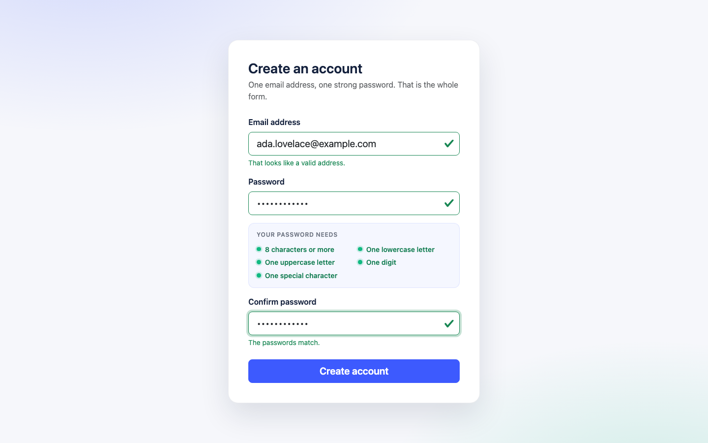
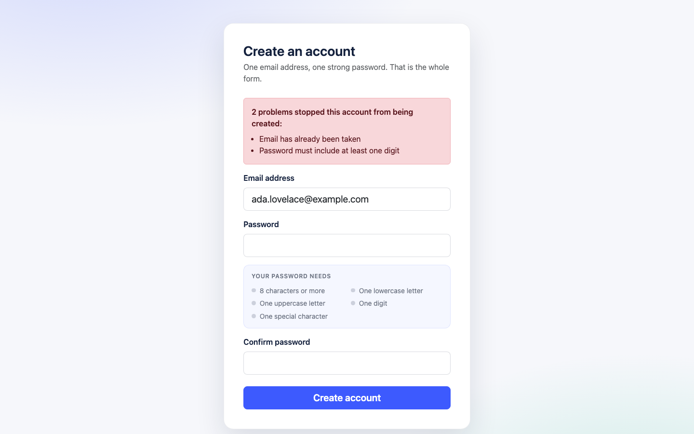
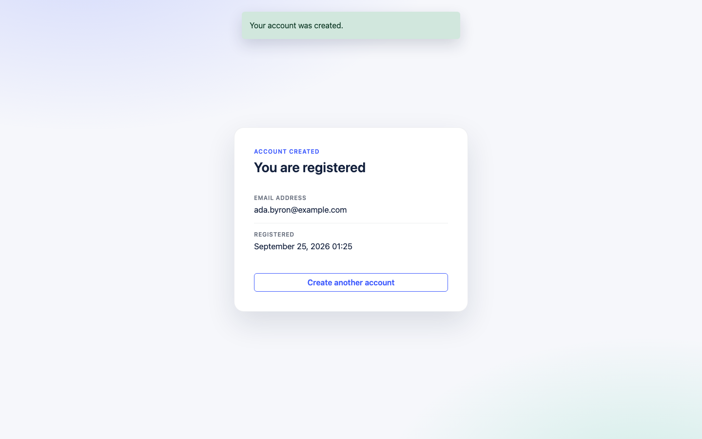
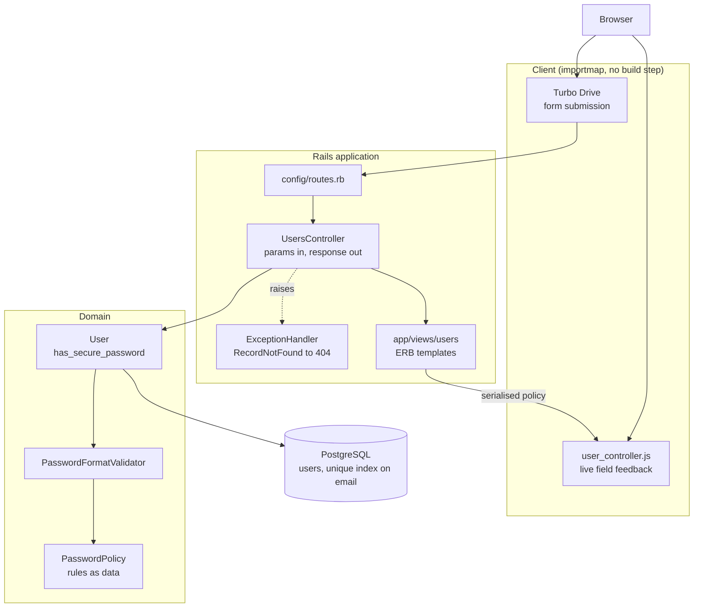
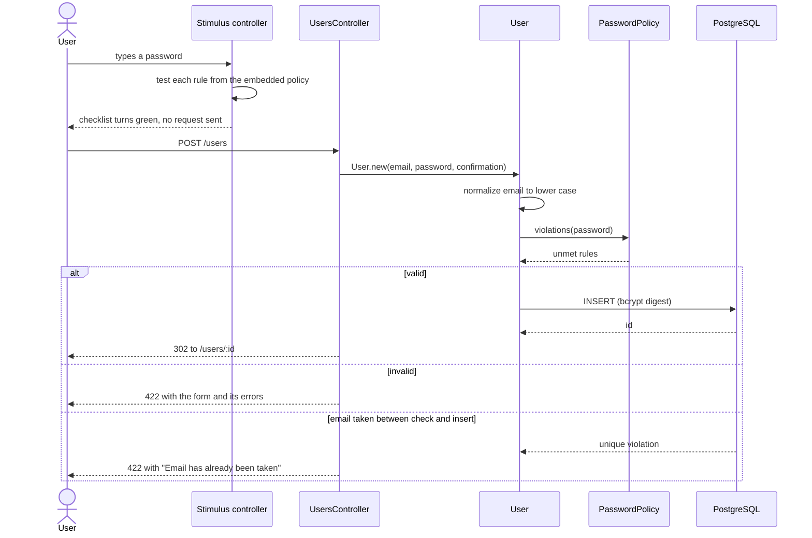

# Bark signup challenge

A single-screen Rails 7.1 application: someone enters an email address and a
password, the password is checked against a published policy on both the client
and the server, and a `User` row is created with a bcrypt digest. It is a
take-home exercise, so it deliberately does one thing — there is no session, no
login and no account management.

The interesting part is that the password rules exist in exactly one place.
`PasswordPolicy` holds them as data; the model validates against them and the
same list is serialised into the form so the Stimulus controller checks the
identical patterns as the user types.

## Screenshots

| Live validation as you type | Server-side errors on a rejected submission |
| --- | --- |
|  |  |

| Account created | Unknown record |
| --- | --- |
|  |  |

Captured with Playwright at 1440x900 against the app running locally with
seeded data (`bin/rails db:seed`).

## Architecture



Dependencies point inward: the controller knows about the model, the model
knows about the policy, and the policy knows about nothing. The browser gets
its rules from the same object the server validates with, so the two cannot
drift.

## Signup flow



## Quickstart

Requires Ruby 3.2.8 and a PostgreSQL server.

```bash
bin/setup                 # bundle install, copy .env.example, create the database
bin/rails db:seed         # optional sample accounts
bin/rails server          # http://localhost:3000
```

With Docker instead:

```bash
cp .env.example .env
echo "SECRET_KEY_BASE=$(bin/rails secret)" >> .env
docker compose up --build   # http://localhost:8570
```

## Configuration

Everything is read from the environment; `config/database.yml` has no literal
credentials in it. `DATABASE_URL`, if set, overrides the individual database
variables below.

| Variable | Required | Default | Purpose |
| --- | --- | --- | --- |
| `DATABASE_HOST` | no | `localhost` | PostgreSQL host |
| `DATABASE_PORT` | no | `5432` | PostgreSQL port |
| `DATABASE_USER` | no | unset (local socket user) | PostgreSQL role |
| `DATABASE_PASSWORD` | no | unset | Password for that role |
| `DATABASE_NAME` | no | `bark_test_challenge_development` | Database in development and production |
| `TEST_DATABASE_NAME` | no | `bark_test_challenge_test` | Database used by the suite |
| `DATABASE_URL` | no | unset | Full connection URL; overrides the five above |
| `RAILS_MAX_THREADS` | no | `5` | Puma threads and the Active Record pool size |
| `RAILS_LOG_LEVEL` | no | `info` | Production log level |
| `FORCE_SSL` | no | `true` | Set to `false` in production when TLS is terminated upstream or when running over plain HTTP |
| `SECRET_KEY_BASE` | production | none | Cookie and signed-message key; generate with `bin/rails secret` |
| `REDIS_URL` | no | `redis://localhost:6379/1` | Action Cable adapter in production only; unused in development and test |

## Development

```bash
bundle exec rspec       # 54 examples, 0 failures
bundle exec rubocop     # 34 files inspected, no offenses detected
bin/rails db:seed       # four sample accounts
```

The suite needs a PostgreSQL server; point it at one with `DATABASE_HOST` /
`DATABASE_PORT` or `DATABASE_URL`. bcrypt runs at its minimum cost factor in
the test environment, so a full run takes about a second.

Tests are layered deliberately:

- `spec/models/password_policy_spec.rb` — the rules themselves, including a
  guard that every pattern stays compilable by JavaScript.
- `spec/models/user_spec.rb` — validations, email normalisation, and that the
  unique index really is the backstop.
- `spec/requests/users_spec.rb` — full request/response with templates
  rendered, which is where a broken re-render shows up.
- `spec/controllers/users_controller_spec.rb` — assignment and template choice.

## Project structure

```
app/
  controllers/
    concerns/exception_handler.rb  RecordNotFound -> 404, app-wide
    users_controller.rb            new / create / show, nothing else
  javascript/controllers/
    user_controller.js             live feedback driven by the embedded policy
  models/
    password_policy.rb             the rules, as data
    user.rb                        validations and email normalisation
  validators/
    password_format_validator.rb   applies the policy to an attribute
  views/users/                     signup form, confirmation, error partial
config/
  locales/en.yml                   every user-facing string
  initializers/content_security_policy.rb
db/
  migrate/                         users table + unique index on email
docs/screenshots/                  the images above
spec/
  models/ requests/ controllers/   see Development
```

## Design notes

**One source of truth for the password rules.** The original implementation
carried the rules twice: a Ruby regular expression in the model and a
hand-written set of checks in JavaScript. They already disagreed — the server
counted a space as a special character, the browser did not. `PasswordPolicy`
now owns the list, `PasswordFormatValidator` applies it server-side, and
`PasswordPolicy.as_json` is embedded in the form as a Stimulus value so the
browser compiles the same patterns. Adding a rule is one entry plus one
translation. A spec asserts the patterns avoid Ruby-only regexp syntax, because
`Regexp#source` is what the browser receives.

**Email is normalised, not compared case-insensitively.** Folding the address
on assignment means the plain unique index on `email` is the real constraint.
The alternative (`uniqueness: { case_sensitive: false }`) issues
`LOWER(email) = LOWER($1)`, which cannot use that index and still lets the
database store two rows for the same address.

**Uniqueness is validated *and* enforced.** The validation produces a readable
error; the index is what holds under concurrency. `create` rescues
`ActiveRecord::RecordNotUnique` and turns the lost race into the same form
error instead of a 500.

**Failed submissions return 422.** Turbo discards a 200 response to a form
submission, so the original code's `render :new` left the page unchanged with
no explanation. The fix is one status code, and a request spec now pins it.

**Scalability, honestly.** This is one table, one insert and one lookup by
primary key; there is no N+1 query to fix and no page that grows with the data.
The only per-request database work is the uniqueness `SELECT`, which the unique
index already serves. What actually matters at load is the connection pool, so
`config/database.yml` sizes it from `RAILS_MAX_THREADS` — the same variable
Puma uses for its thread count — and the production image runs one Puma worker
per core. If this grew a user list, that is where pagination and an index on
`created_at` would belong; adding either now would be decoration.

**Framework surface.** `rails/all` was replaced with an explicit list of
railties, dropping Active Storage, Action Mailbox, Action Text and Action
Mailer, none of which were referenced. Measured boot time did not change
meaningfully (~0.6s either way on the development machine); the benefit is
less configuration to keep correct, not speed. Action Cable stays because Turbo
depends on it, and its development adapter is now `async` so no Redis server is
needed to run the app.

**Content Security Policy.** The app loads no third-party script, style, font
or image, so the policy is `self` throughout, with a per-request nonce for
importmap's inline `<script type="importmap">` and Turbo's injected progress
bar. The signup form's background is CSS rather than the remote CDN image the
original used, which also makes the page render identically offline.

## Limitations

- No authentication. `/users/:id` is a sequential id and anyone who knows one
  can read that account's email address. A real product would show the
  confirmation from a session rather than a guessable URL.
- No password reset, email verification, rate limiting or lockout. Signup is
  the whole feature set.
- Passwords are checked for composition only. Composition rules are weak
  protection compared with a breached-password check; a real system should call
  something like Have I Been Pwned's range API instead.
- `config/credentials.yml.enc` is committed without its key, which is correct
  but means it cannot be decrypted from a clone. Production reads
  `SECRET_KEY_BASE` from the environment instead.
- Docker images are authored but unbuilt here; see `Dockerfile` and
  `docker-compose.yml`.
- No end-to-end browser test in the suite. The flows in the screenshots were
  driven through Chromium manually rather than by a checked-in system spec.
